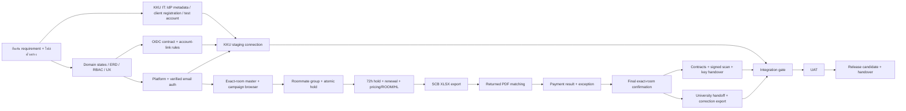
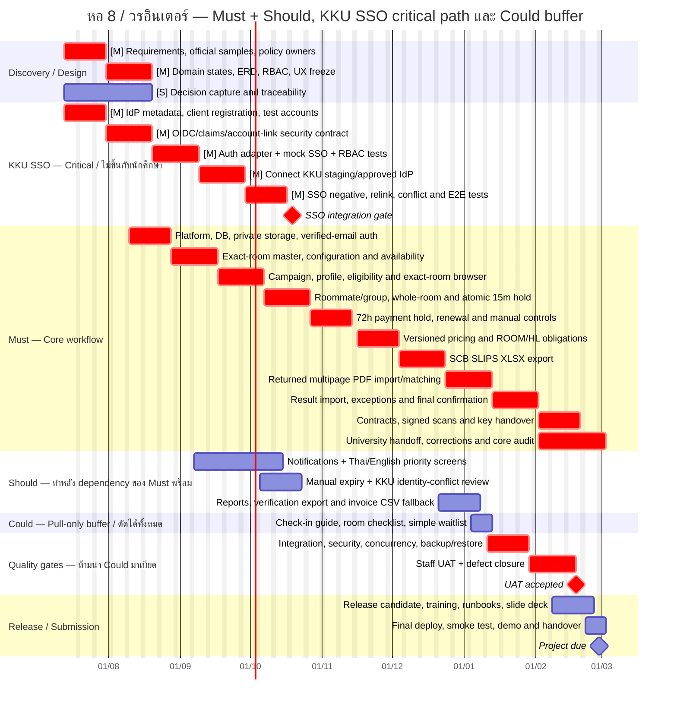

# MoSCoW และ Gantt Chart — ระบบหอ 8 / วรอินเตอร์

อัปเดตจาก Notion export ล่าสุดในเครื่อง: 16 กรกฎาคม 2026  
กำหนดส่งที่ใช้วางแผน: 28 กุมภาพันธ์ 2027  
ขอบเขต: วรเรสซิเดนซ์ / หอ 8 หลัง และหอพักวรอินเตอร์เท่านั้น

## หลักตัดสิน

- ยึด `07 — Live Product Pivot & Stakeholder Notes` และ `08 — Payment Rules, SCB Documents & Reservation Lifecycle` ฉบับแก้ไข 10 กรกฎาคม 2026
- ยึด `16 — Detailed Implementation Plan & Sprint Execution` ฉบับแก้ไข 10 กรกฎาคม 2026 และ `17 — AI-Ready Test-First Implementation Plan` ฉบับแก้ไข 11 กรกฎาคม 2026
- ใช้ Feature Backlog จำนวน 83 รายการเป็นรายการตรวจความครบถ้วน
- ตัดหอ 9 หลังและแนวคิด central-dorm allocation ออกจากโครงการนี้
- exact room เป็น source of truth; การจองมี roommate/group, 15-minute confirmation hold และ 72-hour payment hold
- การชำระเงินปกติใช้ SCB file exchange: ส่งออก XLSX/SLIPS, นำเข้า returned PDF และผลการชำระเงิน ไม่ใช้ applicant slip upload เป็นเส้นทางปกติ
- latest Notion ระบุ production KKU SSO เป็น optional และไม่เป็น gate ของนักศึกษา แต่คำสั่งล่าสุดกำหนดให้ KKU SSO อยู่บน critical path ดังนั้นแผนนี้ยกระดับงาน integration เป็น Must สำหรับ release acceptance โดย personal-email registration ยังต้องทำงานได้ครบทุกขั้นตอน

## สรุป MoSCoW

| กลุ่ม | จำนวน | เกณฑ์ |
|---|---:|---|
| Must have | 55 | ขาดแล้ว workflow หลัก, ความถูกต้องทางการเงิน, ความปลอดภัย หรือการปฏิบัติงานจริงไม่ครบ |
| Should have | 9 | สำคัญต่อคุณภาพ/การส่งมอบ แต่เลื่อนได้โดยระบบแกนหลักยังทำงาน |
| Could have | 3 | ทำเฉพาะเมื่อ Must/Should เสร็จและผ่านเกณฑ์ เป็น buffer ที่ตัดได้ |
| Won't have | 16 | ตกลงไม่ทำในโครงงานนี้ เพราะขัดกับ pivot, อยู่นอก pilot หรือเป็น future integration |
| **รวม** | **83** | ครบทุกแถวใน Feature Backlog |

## Must have

| # ใน backlog | Feature | เหตุผลย่อ |
|---:|---|---|
| 2 | Dorm list with filters | ทางเข้าเลือกเฉพาะหอ 8/วรอินเตอร์และห้องที่สมัครได้ |
| 5 | Application detail review page | เจ้าหน้าที่ต้องตรวจผู้สมัครและประวัติสถานะได้ |
| 10 | Admin override with required reason | ข้อยกเว้นต้องมีเหตุผล สิทธิ์ และ audit |
| 11 | Resident payment obligations and official QR forms | แกน resident-specific SCB payment |
| 15 | Exact-room inventory, configuration and availability | exact room เป็น source of truth |
| 16 | Dorm detail page | ผู้สมัครต้องเห็นข้อมูลหอ ราคา กติกา และห้อง |
| 18 | Roommate invitation, group and room confirmation | แกน shared-room ของ pilot |
| 20 | Verified applicant account + optional KKU SSO linking | บัญชีที่ยืนยันแล้วและโครงสร้าง identity เดียว |
| 23 | Finance payment-obligation, batch and exception dashboard | การปฏิบัติงาน SCB และ exception ของฝ่ายการเงิน |
| 24 | Student profile completion checklist | ป้องกันสมัคร/เชิญ roommate ด้วยข้อมูลไม่ครบ |
| 25 | Admin dashboard overview | ภาพรวม campaign, hold, payment และ room state |
| 27 | Applicant list with filters | คิวงานหลักของเจ้าหน้าที่ |
| 28 | Application status tracker | แสดงสถานะสมัครแบบ exact-room lifecycle |
| 29 | Application round setup | กำหนดช่วงเวลา เงื่อนไข และขอบเขต campaign |
| 30 | Application review and submit screen | ลดข้อมูลผิดก่อนยืนยัน |
| 31 | Audit log | การเปลี่ยนสถานะสำคัญต้องตรวจสอบย้อนหลังได้ |
| 32 | Eligibility validation rules | ป้องกันข้อมูลไม่ครบ สมัครซ้ำ และผิดเงื่อนไข |
| 35 | SCB PDF, result-import and payment-exception queues | คิวเอกสารและ exception ของ payment operations |
| 36 | Affiliated dorm online application form | แบบสมัครออนไลน์หลัก |
| 37 | Manual payment reference/evidence capture | ใช้เฉพาะ exception พร้อม bank reference, note และ audit |
| 38 | Room-category and availability summary | สรุปที่คำนวณจาก exact-room inventory |
| 39 | Campaign landing page for affiliated dorms | ทางเข้า campaign และเงื่อนไขก่อนสมัคร |
| 40 | Applicant type selection | ใช้เลือก rule/payment condition ที่ถูกต้อง |
| 41 | Resident and reservation-group detail with payment documents | มุมมอง 360° ของเจ้าหน้าที่ |
| 42 | Versioned pricing and payment-action rule engine | ราคา ROOM/HL/whole-room ต้อง versioned และตรวจสอบได้ |
| 43 | Dorm manager campaign setup | ตั้ง campaign และกลุ่มผู้สมัคร |
| 44 | Required payment condition display before submit | ต้องรู้ยอด/กำหนด/เงื่อนไขก่อนยืนยัน |
| 45 | Initial exact-room status import and staff correction | ตั้งข้อมูลห้องและผู้พักเริ่มต้นอย่างถูกต้อง |
| 46 | Dorm manager dashboard for live operations | เฝ้าคิวและ hold ระหว่างเปิดรับ |
| 47 | Reservation status tracker | แสดง hold, payment, verification และ confirmation |
| 49 | Payment-document/result rejection, correction and replacement | แก้ PDF/result ผิดโดยไม่ทับประวัติ |
| 50 | Annual renewal and roommate-change flow | latest pivot ระบุ renewal เป็น core |
| 51 | Export approved reservations | ส่งต่อข้อมูลที่ยืนยันแล้ว |
| 53 | Roommate-confirmation and 72-hour payment holds | ป้องกันห้องค้างและกำหนด deadline ของกลุ่ม |
| 54 | Approve reservation after verification | final confirmation ต้องเกิดครั้งเดียวและมีสิทธิ์ |
| 57 | Audit log for approve reject cancel actions | ธุรกรรมสำคัญต้องมี actor/reason/time |
| 58 | Staff role permissions for dorm-specific access | ป้องกันข้อมูลข้ามหอและข้อมูลการเงิน |
| 64 | Exact-room selection and atomic hold | ป้องกัน double-booking |
| 66 | SCB payment-result report import and reconciliation | ผลการชำระเงินปกติมาจากไฟล์ SCB |
| 67 | Official confirmation page | สื่อสารเหตุการณ์ที่ยืนยันอย่างเป็นทางการโดยไม่กล่าวเกินจริง |
| 68 | Manual bank-transaction verification | exception path ต้องตรวจรายการธนาคารจริง |
| 69 | Duplicate payment transaction protection | ป้องกัน transaction เดียวจ่ายหลาย obligation |
| 70 | SCB SLIPS Excel batch export | ขอบเขต integration ที่ได้รับการยอมรับ |
| 71 | Working-day-aware payment verification queue | ป้องกันหมดอายุผิดในวันหยุดเจ้าหน้าที่ |
| 73 | Personal-email registration and verification | นักศึกษาใช้ระบบได้โดยไม่ต้องรอ KKU SSO |
| 74 | Optional KKU SSO login and account linking | ยกระดับเป็น Must/critical path ตามคำสั่งล่าสุด |
| 75 | Grouped printable contracts and physical-signature tracking | สัญญากระดาษรายบุคคลภายใต้กลุ่มห้อง |
| 76 | Whole-room rental occupancy and pricing | occupancy mode ที่ pilot ยืนยันแล้ว |
| 77 | HL dual ROOM and HL payment obligations | เงื่อนไขค่าใช้จ่ายของห้อง HL |
| 78 | Room plan, dimensions and room-master import | ข้อมูลห้องจริงของทั้งสองกลุ่มหอ |
| 79 | Payment exception and group-completion queue | จัดการ one-paid/one-unpaid, ROOM/HL ไม่ครบ และยอดผิด |
| 80 | Manual reservation and manual payment controls | เจ้าหน้าที่แก้กรณีพิเศษโดยไม่แก้ฐานข้อมูลตรง |
| 81 | Signed contract scan and separate key handover | ปิด workflow หลัง payment confirmation |
| 82 | Returned SCB multipage PDF import and resident-page matching | จับคู่ QR form รายคนโดยไม่พึ่ง page order |
| 83 | University handoff queue and correction export | ส่งต่อและแก้ไขข้อมูลโดยไม่ทับประวัติเดิม |

หมายเหตุการเลื่อนขึ้นเป็น Must:

- #10, #31, #37, #57 และ #58 ถูกยกระดับจาก backlog เดิม เพราะ pivot/implementation plan ล่าสุดกำหนดให้ manual actions, private files, payment และ cross-dorm access ต้องมี permission กับ audit
- #74 ถูกยกระดับจาก Should เป็น Must ตามคำสั่งล่าสุด งานนี้เป็น release dependency แต่ไม่เป็น student workflow gate

## Should have

| # ใน backlog | Feature | เหตุผลย่อ |
|---:|---|---|
| 4 | Reports and export | รายงานรวมช่วยงานบริหาร แต่ dashboard/SCB/handoff หลักทำงานได้ก่อน |
| 21 | Student notification center | ลดการพลาด deadline; รุ่นแรกยังใช้สถานะในระบบได้ |
| 22 | Bilingual Thai / English interface | สำคัญต่อวรอินเตอร์ แต่ทยอยแปลหลัง flow หลักนิ่งได้ |
| 34 | Final presentation slide deck | จำเป็นต่อการส่งโครงงาน ไม่ใช่ runtime dependency |
| 48 | Export verification report | ช่วยตรวจสอบและส่งต่อ แต่ไม่บล็อก reconciliation หลัก |
| 52 | Manual expiration for unpaid applications | เป็น fallback; expiry worker เป็นแกนหลัก |
| 59 | Stakeholder meeting preparation and decision capture | ลด policy risk แต่ไม่ใช่ feature ที่ผู้ใช้ปลายทางเรียกใช้ |
| 61 | CSV export for existing invoice workflow | fallback เมื่อรูปแบบ handoff ทางการยังไม่พร้อม |
| 72 | Optional KKU identity-link conflict review | สำคัญเมื่อเปิด linking แต่กรณีปกติยังดำเนินต่อได้ |

## Could have — buffer ที่ตัดได้

| # ใน backlog | Feature | เงื่อนไขก่อนหยิบทำ |
|---:|---|---|
| 6 | Check-in instruction page | Must/Should ผ่าน integration gate แล้ว |
| 7 | Room condition checklist | contract/key-handover flow เสถียรแล้ว |
| 62 | Waitlist when room type is full | ทำได้เฉพาะ simple waitlist ที่ไม่คืน allocation/ranking model |

Could ทั้งสามรายการเป็น pull-only backlog: หาก Must/Should ล่าช้าแม้แต่รายการเดียว ให้ตัด Could ออกทั้งหมดและห้ามเบียดเวลา Integration Testing/UAT

## Won't have — ไม่ทำในโครงงานนี้

| # ใน backlog | Feature | เหตุผล |
|---:|---|---|
| 1 | Maintenance ticket submission | latest pivot ระบุ future scope |
| 3 | Waitlist promotion after cancellation/unpaid offer | automation แบบ allocation/waitlist ยังไม่ใช่ pilot |
| 8 | Allocation simulation | แนวคิด allocation-first ถูก supersede |
| 9 | Waitlist generation and ordering | ยังไม่มีนโยบายจัดลำดับที่อนุมัติ |
| 12 | Appeal / review request | อยู่นอก exact-room pilot core |
| 13 | Ranked dorm preference application form | ขัดกับ exact-room selection |
| 14 | Offer confirmation / decline action | ขัดกับ flow จองห้องจริงโดยตรง |
| 17 | Allocated result explanation screen | ไม่มี allocation result ใน pilot |
| 19 | Preference matching algorithm | แนวคิด allocation-first ถูก supersede |
| 26 | Priority group / score model | แนวคิด fairness/score ถูก supersede |
| 33 | Waitlist position screen | exact-position policy ยังไม่อนุมัติและเป็นโมเดลเดิม |
| 55 | Pilot one dorm before multi-dorm launch | scope ล่าสุดกำหนดหอ 8 และวรอินเตอร์ส่งร่วมกัน |
| 56 | Future automated SCB and university-system integration | file exchange เป็นขอบเขตที่ยอมรับสำหรับโครงการนี้ |
| 60 | Applicant re-upload history | applicant slip upload ไม่ใช่ normal flow; document replacement history อยู่ใน Must #49 |
| 63 | Existing invoice system integration | ต้องใช้สิทธิ์และ coordination ภายนอก; future scope |
| 65 | Future direct SCB/payment-provider API connector | ไม่ทำ real-time bank API ใน pilot |

## Dependency และ critical path

เส้นทาง SSO เป็น critical release path แยกจาก student workflow:

1. ผู้รับผิดชอบภายนอกคือ KKU IT/เจ้าของ IdP ไม่ใช่นักศึกษา
2. สิ่งที่ต้องขอคือ issuer/metadata, client ID/secret, redirect URI approval, scope/claim contract และ institutional test accounts
3. ใช้ mock IdP พัฒนาได้ก่อน แต่ release integration gate จะไม่ผ่านจนทดสอบกับ KKU staging/approved environment
4. personal-email registration ยังต้องผ่าน application → reservation → payment → contract → key handover ได้ แม้ไม่ได้ link SSO

## Gantt chart

ปฏิทินนี้รักษากำหนดเดิม 13 กรกฎาคม 2026–28 กุมภาพันธ์ 2027 และกันเวลา Integration Testing + UAT รวม 4 สัปดาห์เต็ม โดยจบ UAT ก่อนกำหนดส่ง 3 สัปดาห์

## Dependency table

| งาน | Depends on | ปลดล็อก | เงื่อนไขผ่าน |
|---|---|---|---|
| Requirement/sample closure | ผู้ถือข้อมูลห้อง, SCB, สัญญา, university handoff | Domain/ERD และ document adapters | มีไฟล์จริงหรือ substitute ที่มี owner/deadline |
| KKU SSO access | KKU IT/IdP owner เท่านั้น | staging connection | ได้ metadata, client registration และ test account |
| Auth foundation | Domain/RBAC + private storage | SSO adapter และ applicant/staff shell | verified email, session, dorm scope และ private files ผ่าน test |
| SSO staging integration | Auth foundation + KKU access + OIDC contract | release integration gate | login/link/relink/conflict/logout/permission tests ผ่าน |
| Exact-room master | official room source + platform | browser/campaign | ห้อง unique, versioned, import/correct/block ได้ |
| Group/atomic hold | room availability + complete profile | payment hold | concurrent reserve สำเร็จเพียงหนึ่ง, expiry idempotent |
| Pricing/obligations | ready group + room config + applicant type | SCB export | ROOM/HL/whole-room ถูกต้องและมี price snapshot |
| SCB XLSX | official template + obligations | returned PDF import | workbook schema/golden test ผ่าน |
| Returned PDF matching | XLSX batch + returned PDF sample | result reconciliation | ไม่พึ่ง page order/Ref.1+Ref.2 และเก็บ unmatched queue |
| Payment result/final confirmation | obligations + PDF/result sample | contracts/handoff | duplicate/late/under/over/one-paid-one-unpaid ตรวจได้; confirm once |
| Contracts/key handover | final confirmation + approved template | UAT | shared 2 contracts, whole-room 1, private scan, separate key record |
| University handoff/correction | final confirmation + official schema | UAT | original immutable, correction แยก batch |
| Integration Testing | Must/Should feature-complete + SSO gate | UAT | ไม่มี high-severity auth/data-loss/double-book/double-pay defect |
| UAT | integration gate | release candidate | ผู้ใช้ตัวแทนลงนามรับหรือให้ bounded closure list |

## กติกาปกป้องกำหนดส่ง

1. 4 มกราคม 2027 เป็น feature freeze ของ Must/Should
2. Could เป็นงานแบบ pull-only; ถ้า Must/Should หรือ defect ค้าง ให้ตัด Could ทันที
3. 11 มกราคม–5 กุมภาพันธ์ 2027 สงวนให้ Integration Testing และ UAT รวม 4 สัปดาห์ ห้ามเพิ่ม feature ใหม่
4. SSO ใช้ mock/บัญชีทดสอบของสถาบัน จึงไม่รอการรับสมัครหรือข้อมูลนักศึกษาจริง
5. หาก KKU staging access ไม่พร้อมตาม SSO gate ให้ยกระดับเป็น external blocker ทันที แต่ยังเดิน verified-email และ core workflow ต่อเพื่อไม่สูญเสียเวลา
6. 8–28 กุมภาพันธ์ 2027 ใช้เฉพาะ release-blocking fixes, training, runbook, final presentation, deployment rehearsal และ handover

## Policy gaps ที่ต้องปิดก่อน code freeze

- รูปแบบ claim/scope และเจ้าของอนุมัติ production KKU SSO
- ราคา/เงื่อนไขผู้สมัครต่างชาติของวรอินเตอร์
- Ref.2 สำหรับ installment และการรวม ROOM/HL ใน batch
- final policy เมื่อ roommate จ่ายเพียงคนเดียว
- authority ที่ยืนยันว่า exact room “ยืนยันแล้ว”
- contract template/copies/retention และ key-handover form
- university handoff/correction columns
- วันหยุดประจำสัปดาห์ของ payment-verification staff
- official room master, room plan และ dimensions ของทั้งสองกลุ่มหอ
